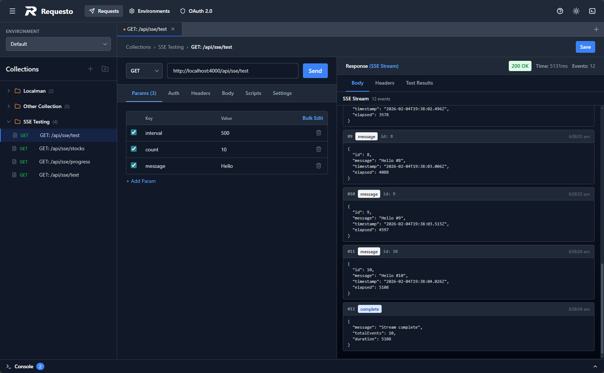
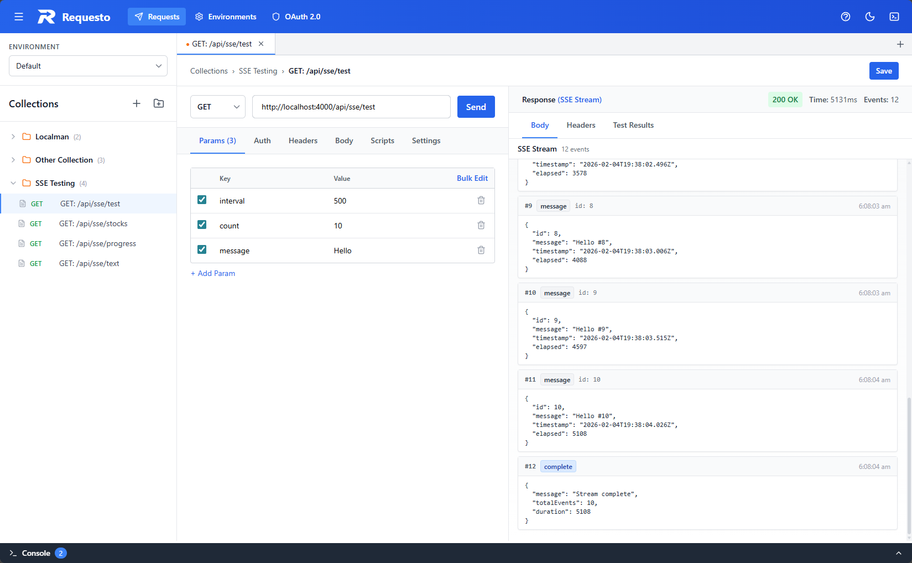

# Requesto

A modern, lightweight API client (Postman alternative) available as both a desktop application and self-hosted web service. Test HTTP APIs with a beautiful interface, environment variables, OAuth 2.0 support, and complete offline capability.

| Dark Mode | Light Mode |
|-----------|------------|
|  |  |

## Features

- 🚀 **Multiple deployment options**: Desktop app (Windows/macOS/Linux), Docker, or from source
- 📡 **Full HTTP support**: GET, POST, PUT, PATCH, DELETE, and more
- 🔐 **OAuth 2.0**: Built-in OAuth configuration and token management
- 🌍 **Environment variables**: Switch between dev, staging, and production environments
- 📁 **Collections & folders**: Organize requests with drag-and-drop
- 🎨 **Dark/Light themes**: Beautiful interface that adapts to your preference
- 💾 **Local storage**: All data stored locally - no cloud required
- 🔒 **CORS-free**: Backend proxy eliminates CORS issues
- ⚡ **Monaco editor**: Powerful code editing with syntax highlighting
- 📜 **Request history**: Never lose a request
- 🔄 **SSE support**: Test Server-Sent Events endpoints

## Quick Start

### Desktop Application (Recommended)

Download the installer for your platform:
- **Windows**: `.exe` installer or portable
- **macOS**: `.dmg` installer
- **Linux**: `.AppImage` or `.deb`

### Docker

```bash
docker-compose up
```

Then open your browser to `http://localhost:4000`

### From Source

```bash
npm install
npm run dev
```

Frontend will be available at `http://localhost:5173`

## Development

### Prerequisites

- Node.js 20+
- npm or yarn

### Available Scripts

```bash
# Development
npm run dev                    # Run backend + frontend
npm run dev:electron           # Run backend + frontend + electron

# Building
npm run build                  # Build all apps
npm run build:backend          # Build backend only
npm run build:frontend         # Build frontend only
npm run build:electron         # Build electron only

# Electron packaging
npm run package:electron       # Package for current platform
npm run package:electron:win   # Package for Windows
npm run package:electron:mac   # Package for macOS
npm run package:electron:linux # Package for Linux

# Docker
npm run docker:build           # Build Docker image
npm run docker:up              # Build and run with docker-compose
npm run docker:down            # Stop docker-compose
```

## Architecture

- **Frontend**: React + TypeScript + Vite + TailwindCSS + Monaco Editor
- **Backend**: Node.js + Fastify + TypeScript
- **Desktop**: Electron
- **Storage**: JSON file-based (collections.json, environments.json, history.json, oauth-configs.json)
- **Infrastructure**: Docker + docker-compose

## Documentation

- **[Getting Started](docs/GETTING_STARTED.md)** - Detailed user guide and tutorials
- **[Deployment Guide](docs/DEPLOYMENT.md)** - Production deployment instructions
- **[Project Plan](docs/PROJECT_PLAN.md)** - Technical roadmap and architecture
- **[Security](SECURITY.md)** - Security policy and vulnerability reporting

## License

MIT

