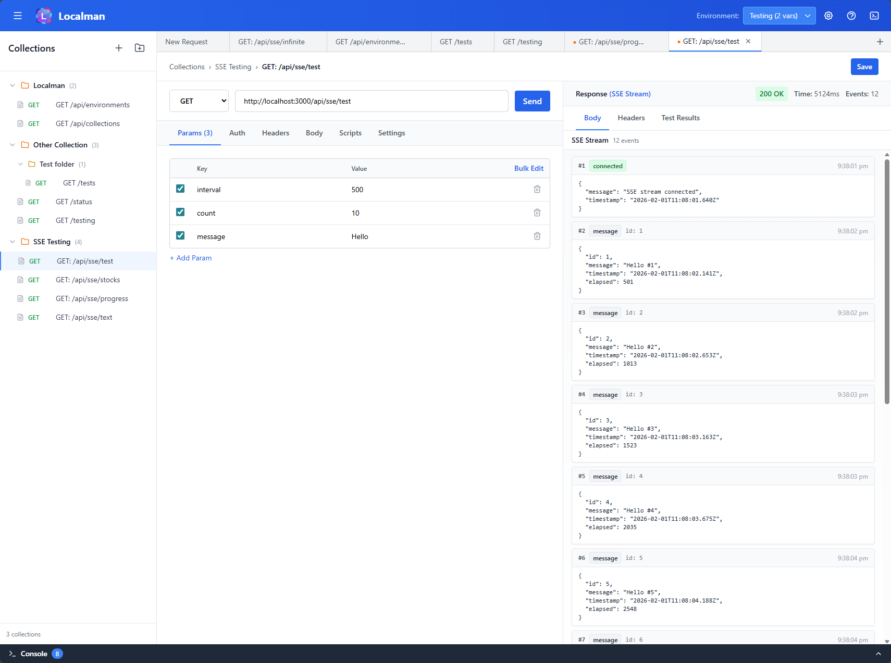

# Localman

A lightweight, self-hosted API client (Postman alternative) that can be started via Docker and immediately used to test HTTP APIs through a web UI.



## Features

- Send HTTP requests (GET, POST, PUT, PATCH, DELETE)
- Edit headers and request bodies
- View responses clearly (status, headers, body, timing)
- Persist requests locally
- Support environment variables
- Avoid CORS issues via backend proxy
- Docker-first, self-hosted, offline-capable

## Quick Start

```bash
docker-compose up
```

Then open your browser to `http://localhost:3000`

## Development

### Prerequisites

- Node.js 20+
- Docker
- Docker Compose

### Setup

```bash
# Install all dependencies
npm install
```

### Running Locally

```bash
# Run locally
npm run dev
```

## Architecture

- **Frontend**: React + TypeScript + Vite + TailwindCSS
- **Backend**: Node.js + Fastify + TypeScript
- **Database**: SQLite (better-sqlite3)
- **Infrastructure**: Docker + docker-compose

## Documentation

- **[Project Plan](docs/PROJECT_PLAN.md)** - Detailed project roadmap and architecture
